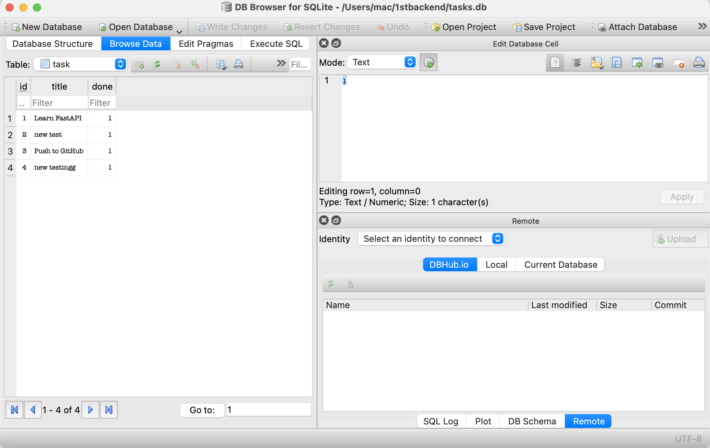

# Task API with SQLite

## Overview

This project is a CRUD (Create, Read, Update, Delete) API built with **FastAPI**, **SQLModel**, and **SQLite**. It manages a to-do list and stores tasks in a SQLite database instead of an in-memory list.

Unlike the previous version, tasks are stored permanently and remain available after the server restarts.

## Technologies Used

- Python 3
- FastAPI
- SQLModel
- SQLite
- Uvicorn

## Why SQLite?

SQLite was chosen because it is lightweight, requires no separate database server, and stores all data in a single file. It is ideal for small applications and learning database fundamentals.

## Database Location

The SQLite database file is automatically created in the project folder as:

```
tasks.db
```

The application automatically creates the database and the required table if they do not already exist.

## Installation

Clone the repository:

```bash
git clone https://github.com/eruranejosh/BackEnd-CRUD-API.git
```

Move into the project folder:

```bash
cd BackEnd-CRUD-API
```

Create a virtual environment:

```bash
python3 -m venv backendapi
```

Activate the virtual environment:

```bash
source backendapi/bin/activate
```

Install the required packages:

```bash
pip install -r requirements.txt
```

Run the application:

```bash
uvicorn main:app --reload
```

## Swagger UI

Open your browser and visit:

```
http://127.0.0.1:8000/docs
```

## API Endpoints

| Method | Endpoint | Description |
|--------|----------|-------------|
| GET | /tasks | Get all tasks |
| GET | /tasks/{id} | Get one task |
| POST | /tasks | Create a new task |
| PUT | /tasks/{id} | Update a task |
| DELETE | /tasks/{id} | Delete a task |

## Example SQL Query

```sql
SELECT * FROM task;
```

## Database Screenshot

Add a screenshot of the **task** table opened in **DB Browser for SQLite** here.

Example:

```

```

## Features

- SQLite database
- Automatic database creation
- Automatic table creation
- Full CRUD functionality
- Input validation
- Swagger UI documentation
- Persistent data after server restart

## Author

Joshua Erurane
